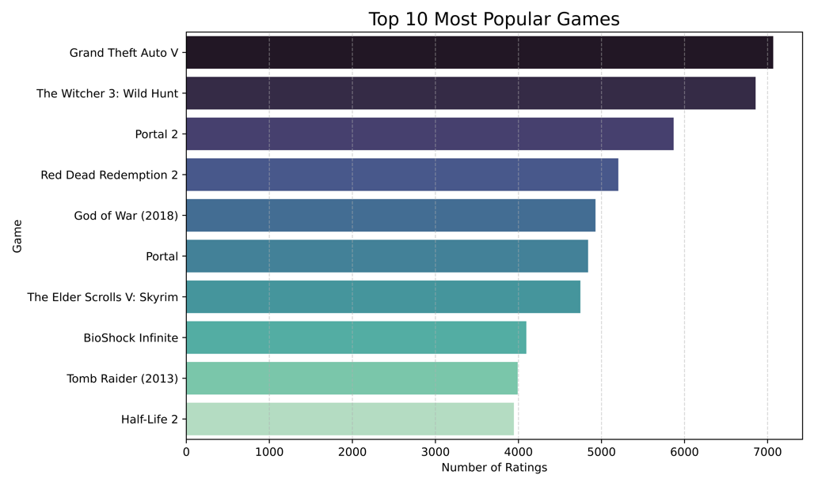

# Exploratory Analysis of Video Game Data

In this project, I explore video game data obtained from the RAWG API. The goal is to extract meaningful insights from the dataset and create informative visualizations that highlight various aspects of the gaming industry.

## Data Source  
The data was sourced from the RAWG API using the URL:  
 "https://api.rawg.io/api/games?search=action&key=API_KEY"
The resulting dataset, saved as `rawg_games_data.csv`, contains over 16,000 rows derived from approximately 400 API pages. An API key was generated by creating a new user account and incorporating the key into the data request URL.

## Notebooks  
This project includes two notebooks:  
- **Masoum_Final_Project.ipynb**: For data exploration and analysis.  
- **Final_Project.py**: For deploying an interactive dashboard using Streamlit.

---

## Data Cleaning  
Data cleaning is essential for robust analysis. The initial dataset consisted of 33 columns, many of which contained JSON data stored as strings. Several columns were entirely empty (e.g., `user_game`, `clip`), and others such as `esrb_rating`, `metacritic`, and `community_rating` had many missing values. Stringified JSON columns containing complex data—such as `ratings`, `genres`, and `platforms`—were parsed into usable formats.  
After cleaning, the dataset comprises 24 features, including:  
- `id`, `name`, `released`, `tba`, `rating`, `rating_top`, `ratings`,  
- `ratings_count`, `reviews_text_count`, `added`, `metacritic`,  
- `playtime`, `suggestions_count`, `reviews_count`, `platforms`, `genres`,  
- `esrb_rating`, `genres_list`, `platforms_list`, `year`, `release_year`,  
- `genre_names`, `platform_names`, `esrb_rating_clean`

---

## Analysis

### **Top 10 Platforms (Games After 2014)**  

The chart above displays the number of games available on each platform after 2014. PC dominates with the largest library, reflecting its open platform nature, while consoles such as PlayStation 4 and Xbox One follow closely. Notably, newer platforms and consoles tend to feature more games than older systems.

---

### **Game Releases Over the Years**  

Game releases over time show a clear upward trend. In the early years (1970s–1980s), relatively few titles were released. However, starting in the 1990s—especially after the 2000s—the number of releases accelerated dramatically, illustrating the rapid growth and increasing accessibility of video games. Notably, 2016 stands out as a record year in the industry.

---

### **Average Rating by Genre**  

The average user rating by genre reveals subtle differences: indie and RPG games, for example, score slightly higher on average compared to genres like racing or casual games. However, most genres have average ratings between 3.4 and 3.6, suggesting that overall player satisfaction is fairly consistent across different types of games.

---

### **User Rating vs. Metacritic Score**  

This scatter plot demonstrates a strong positive correlation between user ratings and Metacritic scores. Generally, games with high critic scores also receive favorable ratings from players, although a few outliers exist where user sentiment diverges from critic reviews. Overall, the trend indicates that quality is recognized by both audiences and professionals.

---

### **Top Games by Rating**  

The chart above lists the top 10 games by average user rating (among those with a significant number of ratings). Critically acclaimed titles such as *Red Dead Redemption 2*, *Half-Life 2*, *Portal 2*, and *God of War (2018)* lead the list with average ratings around 4.5–4.7 out of 5. This reflects a highly positive reception from the gaming community, aligning with these titles’ reputation as some of the best in their genres.

---

### **Top Games by Popularity**  

In contrast, the top 10 most popular games—based on the number of user ratings—highlight titles like *Grand Theft Auto V* and *The Witcher 3: Wild Hunt*. Other popular games, such as *The Elder Scrolls V: Skyrim*, *Portal 2*, and *Counter-Strike*, also exhibit high engagement. Many of these titles overlap with the highest-rated games, suggesting that broad appeal often goes hand-in-hand with high satisfaction.

---

### **User Rating by Percentage**  

Most users rate games as "recommended" or "exceptional," indicating a generally positive community sentiment.

---

### **Distribution of Average User Ratings**  

The distribution of average user ratings is roughly bell-shaped and centered around 3.5 out of 5. Most games receive moderate to good ratings, with the majority falling between 3.0 and 4.5. Extreme ratings (very low or perfect scores) are rare, emphasizing that truly outstanding games are uncommon.

